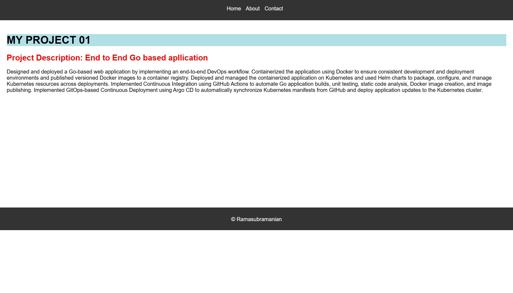
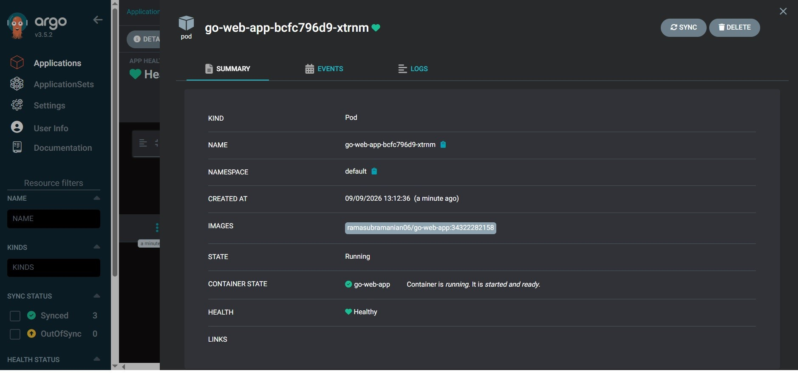

# 🚀 Go Web App — End-to-End CI/CD & GitOps on AWS EKS

A lightweight Golang web application, wrapped in a complete production-style DevOps pipeline: **GitHub Actions → Docker Hub → Helm → ArgoCD → AWS EKS**.

The app itself is intentionally simple — a `net/http` server serving three static pages. The point of this project isn't the app; it's proving I can take application from a `git push` to a running pod on a Kubernetes cluster, automatically, safely, and repeatably.



---

## 🧱 Architecture

```
Developer → GitHub → GitHub Actions CI/CD → Docker Hub → ArgoCD (GitOps) → AWS EKS
                          │                                    │
                    build · test · lint                  Helm chart (auto-synced)
```

**Flow on every push to `main`:**
1. **Build & Unit Test** — compiles the Go binary and runs `go test ./...`
2. **Code Quality** — static analysis via `golangci-lint`, run in parallel with the build
3. **Docker Build & Push** — multi-stage Dockerfile builds a minimal image and pushes it to Docker Hub, tagged with the unique GitHub Actions `run_id` (immutable image tags — no `latest`)
4. **Helm Chart Update** — the pipeline rewrites `values.yaml` with the new image tag and commits it back to the repo, using `paths-ignore` to prevent the commit from re-triggering the pipeline (avoids an infinite loop)
5. **ArgoCD Sync** — ArgoCD watches the Helm chart in Git and automatically deploys the new version to the EKS cluster — no manual `kubectl apply`, ever

This is a **GitOps** pattern: Git is the single source of truth for what's running in the cluster.

---

## 🛠️ Tech Stack

|---|---|
| **Application** | Go (`net/http`, no external web framework) |
| **CI** | GitHub Actions (build, test, lint) |
| **Containerization** | Docker (multi-stage build → distroless final image) |
| **Registry** | Docker Hub |
| **Package/Deploy** | Helm chart |
| **GitOps CD** | ArgoCD |
| **Orchestration** | Kubernetes (AWS EKS) |
| **Networking** | Kubernetes Ingress (NGINX) |

---


## 📁 Repository Structure

```
.
├── main.go                    # HTTP server + route handlers
├── main_test.go                # Unit tests for handlers
├── Dockerfile                  # Multi-stage build → distroless runtime
├── static/                     # HTML pages (home, about, contact)
├── kubernetes/                 # Plain K8s manifests (Deployment, Service, Ingress)
├── helm/go-web-app-chart/      # Helm chart used for actual GitOps deployment
└── .github/workflows/ci.yaml   # Build → Test → Lint → Push → Update Helm tag
```

---

## ⚙️ Running It Locally

```bash
go build -o main
./main
```
Visit `http://localhost:8080`

---

## 📸 Pipeline in Action

| CI Build | Docker Image Pushed | ArgoCD Sync | EKS Cluster |
|---|---|---|---|
|  |  |  |  |

---


**Author:** [Ramasubramanian](https://github.com/ramasubramanian06) — building hands-on toward a DevOps role.
